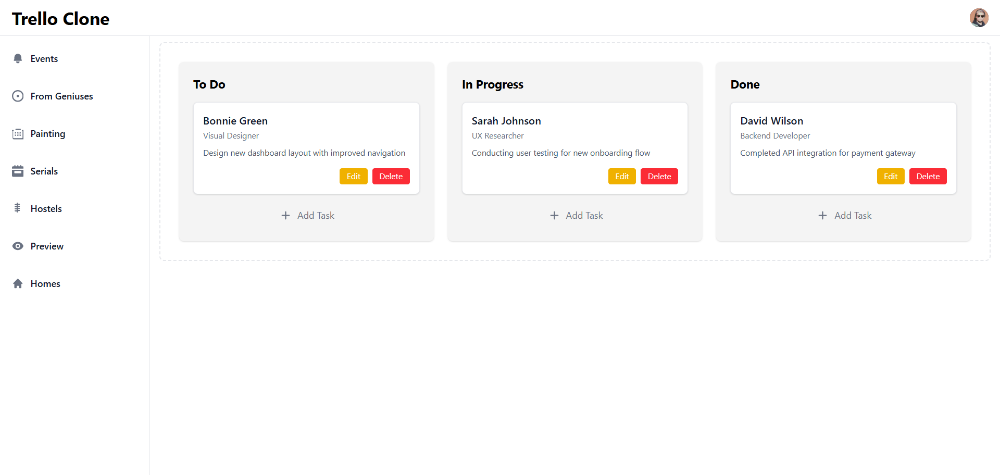

# 🗂️ Trello Clone (React + Vite)

A **Trello-like task management app** built with **React** and **Vite**.  
This project allows users to create boards, columns, and cards, similar to Trello.

---

## 🚀 Features
- ✅ Create and manage boards
- ✅ Add, edit, and delete tasks (cards)
- ✅ Drag-and-drop functionality
- ✅ Responsive design
- ✅ Built with React + Vite

---

## 📸 Project Screenshot


---

## 🛠️ Tech Stack
- **React** (Vite)
- **JavaScript (ES6+)**
- **CSS Modules / Tailwind** (if used)
- **React Beautiful DnD** (for drag and drop)

---

## 🔧 Installation & Setup
```bash
# Clone this repository
git clone https://github.com/prodeveloperjunaid/Trello-Clone.git

# Navigate into the project folder
cd Trello-Clone

# Install dependencies
npm install

# Start the development server
npm run dev